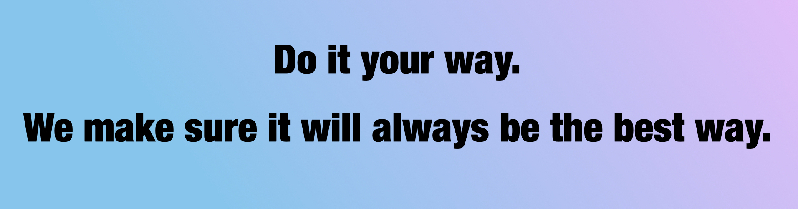

## About

This is the prototype for a navigation app concept my group and I developed for the _Accenture Industry X - Engineering Student Program_. 
I did the design aswell as the implementation of our prototype.

## The concept

## Technical Details

- UI Prototype using _SwiftUI_ Framework
- developed for iPhone with iOS17 or newer

This is by no means supposed to be a functional application and contains no backend or application logic whatsoever. It is rather thought to be a showcase how such an app might look and feel like.